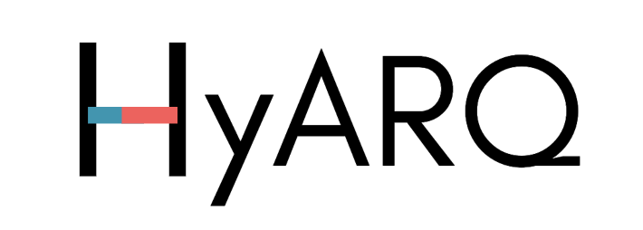
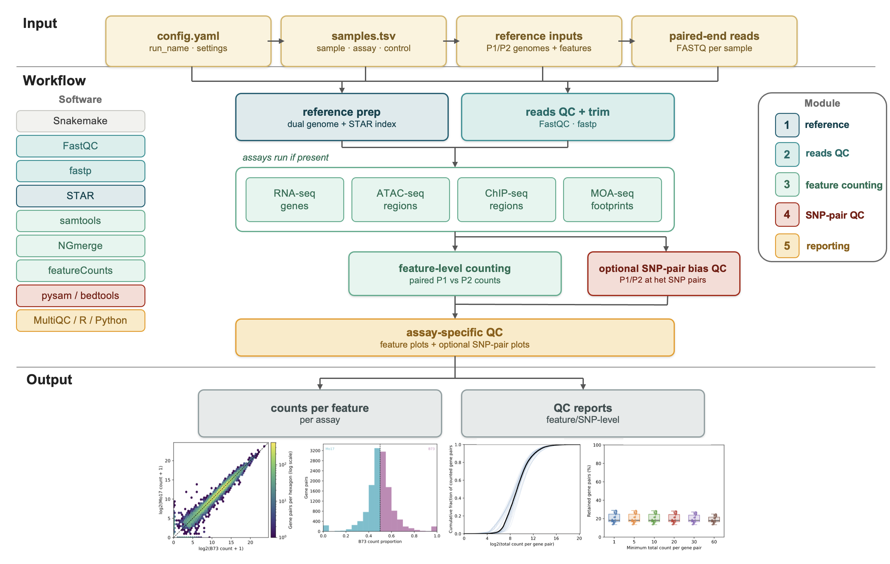

<p align="center">
  
</p>

## Hybrid Allele-specific Read Quantification

A Snakemake workflow for allele-specific read counting and quality control in plant and other hybrids. It builds a two-haplotype concatenated reference and maps RNA-seq, ATAC-seq, ChIP-seq, or MOA-seq to generate allele counts with reduced mapping bias and built-in QC visualizations. This pipeline can be used to study allele-specific expression, cis-regulatory variation, and heterosis where two parental genomes are available.

## Workflow

<p align="center">
  
</p>

## Main Elements

- Supports RNA-seq, ATAC-seq, ChIP-seq, or MOA-seq data
- Uses Snakemake, a Python-based workflow management tool
- Generates informative QC plots to visualize parental imbalance, count thresholds, and outliers

## Installation and Usage

#### Clone the repository
```bash
git clone https://github.com/gagelab/HyARQ.git
cd HyARQ
```
#### Create the Conda environment 

#### Required inputs
1. config.yaml
2. samples.tsv
3. Reference inputs
